# **Docker-Guide**

---
## Why we want Docker?

Docker is important because it solves common issues related to software development and deployment by providing a consistent and isolated environment for applications. 

- one or more files missing.
- software version mismatch.
- different configuration settings.


## Why Docker Is Important:
#### **1. Consistency**
The same Docker container works identically on any system with Docker installed, ensuring that software runs reliably regardless of the environment.

#### **2. Isolation**
Each container runs in its isolated environment, preventing conflicts between applications or services running on the same host.

#### **3. Portability**
Applications in Docker containers can easily be moved between development, testing, and production, reducing deployment headaches.

#### **4. Efficient Resource Use**
Docker containers are lightweight and share the host OS kernel, making them more efficient than traditional virtual machines.

#### **5. Ease of Collaboration**
Teams can share the same containerized environment, ensuring that everyone works with the same setup. This eliminates environment-related discrepancies.

#### **6. Simplified Project Deletion**

**Importance**: When a project needs to be deleted, Docker makes it straightforward by encapsulating the entire application, dependencies, and configurations in containers and images.

**How**: By removing the container and its associated image (docker rm and docker rmi), all files, dependencies, and settings tied to the project are erased from the system without leaving behind residual files or affecting other projects.

**Benefit**: This prevents clutter and ensures that the system remains clean without manual hunting for files, dependencies, or configurations to delete.

---

# Containers vs Virtual Machines

## **What is a Container?**
- An isolated environment for running an application.

## **What is a Virtual Machine?**
- An abstraction of a machine (physical hardware).

### **What are Virtual Machines Used For?**

Virtual Machines (VMs) provide an isolated environment that emulates physical hardware, enabling multiple operating systems to run on a single host machine. They are commonly used for:  
1. **Application Testing**: Testing applications on different operating systems or configurations.  
2. **Legacy Software**: Running software that requires outdated or specific environments.  
3. **Server Consolidation**: Running multiple servers on one physical machine to save resources.  
4. **Development and Training**: Providing isolated, disposable environments for developers or training purposes.

### Example:


- **Virtual Machine 1**: App 1, Node 14, Mongo 4
-  
  Virtual Machine 1 can be used to host an application that requires Node.js version 14 and MongoDB version 4. This setup ensures that the application has a dedicated environment without conflicts from other applications or dependencies.

- **Virtual Machine 2**: App 2, Node 9, Mongo 3  
  
  Virtual Machine 2 provides an isolated space for running another application with Node.js version 9 and MongoDB version 3. It is particularly useful for legacy applications or projects that require older versions of software to function correctly.

## **Hypervisors**
- Hypervisors act as the foundation for running virtual machines.

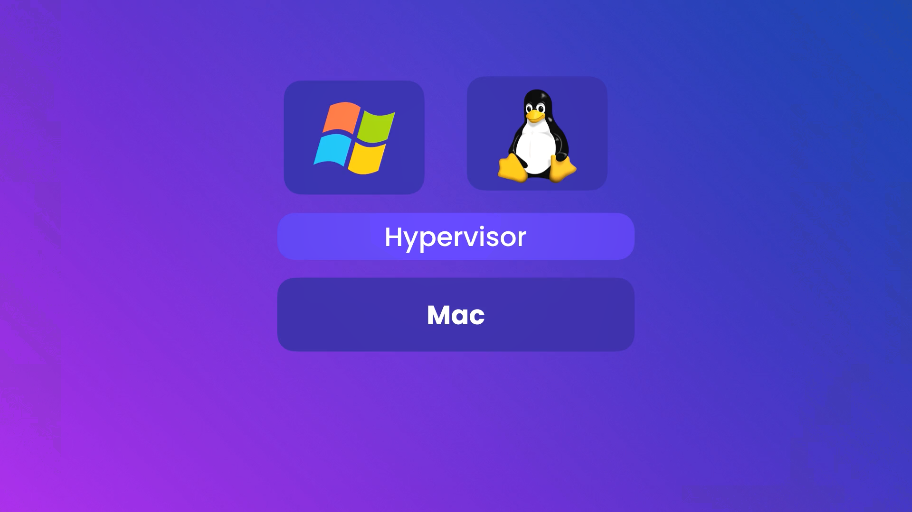

### Common Hypervisors:
- VirtualBox
- VMware
- Hyper-V (Windows only)


## **Problems with Virtual Machines**
1. Each VM needs a full-blown OS.
2. Slow to start.
3. Resource-intensive.

## **Benefits of Containers**
1. Allow running multiple apps in isolation.
2. Lightweight.
3. Use the OS of the host.
4. Start quickly.
5. Need less hardware resources.
---
# Docker Architecture and Usage

## Overview

Docker is a platform that enables developers to build, deploy, and manage applications in lightweight containers. It leverages containerization technology to create isolated environments for running applications, ensuring consistency and efficiency across various platforms.

---

# Docker Client-Server Architecture

### Client and Server

Docker follows a **Client-Server Architecture**:

- **Client**: Sends requests to the server to perform tasks such as building, running, and managing containers. These requests are sent via REST APIs.
- **Server (Docker Engine)**: Processes client requests and handles container operations.

### REST API

**REST API (Representational State Transfer API)** is a communication method used for client-server interaction. It uses HTTP methods like `GET`, `POST`, and `DELETE` for resource management.

In Docker:

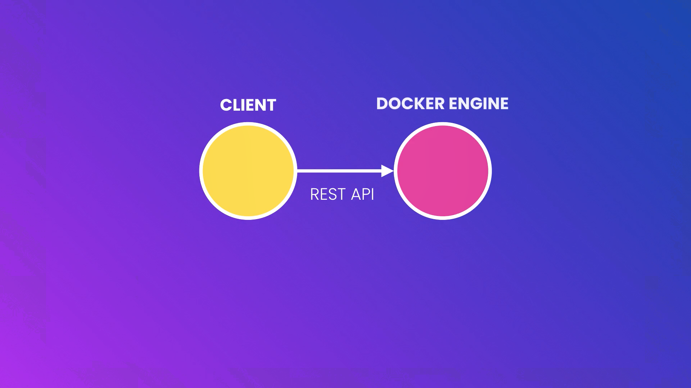

1. **Client** sends a REST API request to the server (Docker Engine).
2. **Docker Engine** interprets the request and executes the corresponding action (e.g., creating or starting a container).

Example:

- The client sends a `docker run` command → Translates into a REST API request → Docker Engine executes the request.
 
### Kernel

The **kernel** is the core component of an operating system, managing system resources and communication between hardware and software. In the context of Docker:

- **Linux Kernel**: Docker relies on features like namespaces and cgroups in the Linux kernel to provide isolation and resource management for containers.
- **Windows Kernel**: For Windows containers, Docker utilizes Windows Server Containers or Hyper-V isolation to run containers natively on the Windows kernel.

### **It's important to note that Docker containers share the host system's kernel; they do not have their own separate kernel. This shared kernel approach allows containers to be lightweight and efficient, as they avoid the overhead associated with running separate operating system instances, unlike traditional virtual machines**

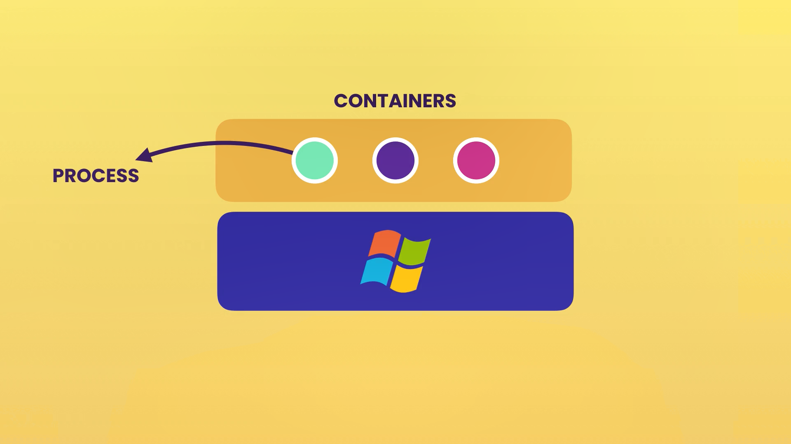

### Containers and Processes

- Containers are lightweight, isolated environments that run applications.
- They share the **host OS kernel**, making them faster and more resource-efficient than virtual machines (VMs).
- A container can be thought of as a **process** running on the host operating system.


## Docker on Various Platforms

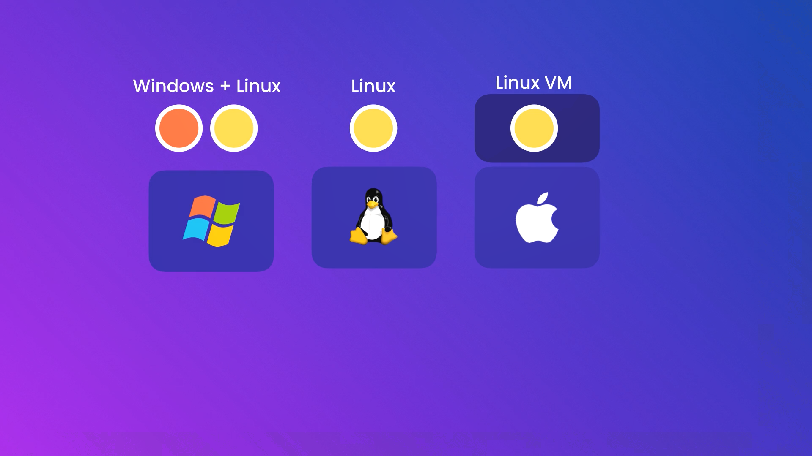

### Windows

On Windows, Docker can run both Windows and Linux containers, but not simultaneously. Users can switch between the two modes:

1. **Windows Containers**: Run natively on the Windows kernel.
2. **Linux Containers**: Run within a lightweight virtual machine provided by the Windows Subsystem for Linux 2 (WSL 2).

**Windows Subsystem for Linux (WSL)** is a compatibility layer for running Linux binary executables natively on Windows. **WSL 2** introduces a full Linux kernel, improving performance and system call compatibility. Docker Desktop leverages WSL 2 to run Linux containers on Windows efficiently. :contentReference[oaicite:0]{index=0}

### Linux

On Linux systems, Docker runs natively:

- **Native Execution**: Docker utilizes the host's Linux kernel features, such as namespaces and cgroups, to create isolated containers without the need for a separate virtual machine. This results in efficient and performant container operations. :contentReference[oaicite:4]{index=4}


### macOS

On macOS, Docker utilizes a Linux virtual machine to run containers:

- **Hypervisor Framework**: Docker Desktop for Mac uses Apple's Hypervisor framework to create a lightweight virtual machine that runs a Linux kernel. This VM hosts the Docker Engine and manages containers. :contentReference[oaicite:2]{index=2}

- **File System and Network Integration**: Docker Desktop integrates with macOS to provide seamless file system sharing and network connectivity between the host and the containers. :contentReference[oaicite:3]{index=3}


---

# Step-by-Step Guide to Install Docker Desktop on Your System


## 1. Download Docker Desktop
#### Step 1: Visit the Official Website
Navigate to the Docker Desktop page at: [https://www.docker.com/products/docker-desktop/](https://www.docker.com/products/docker-desktop/).

#### Step 2: Choose Your Platform
On the webpage:

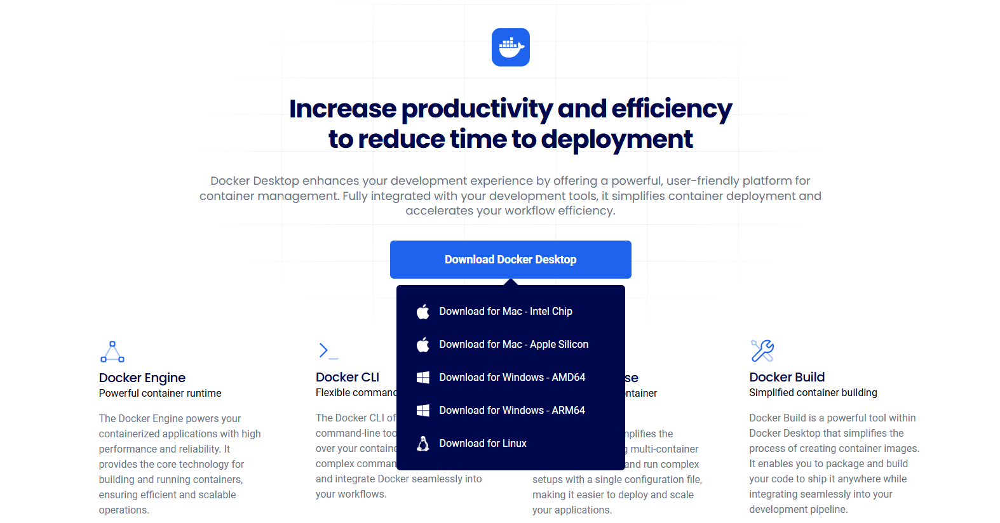

1. Click the **Download Docker Desktop** button.
2. A dropdown menu will appear (as seen in the screenshot).
3. Select the appropriate version based on your system:
   - **Windows**: 
     - If you have a 64-bit processor, choose `Download for Windows - AMD64`.
     - For ARM-based processors, choose `Download for Windows - ARM64`.
   - **Mac**: Choose the version matching your chip type (`Intel Chip` or `Apple Silicon`).
   - **Linux**: Click `Download for Linux`.
4. The download will start, and you’ll receive a `.exe` file for Windows.


## 2. Install Docker Desktop

#### Step 1: Run the Installer
1. Locate the downloaded `.exe` file (e.g., `Docker Desktop Installer.exe`) in your **Downloads** folder.
2. Double-click the installer to run it.

#### Step 2: Follow the Setup Wizard
1. **Welcome Screen**: A setup wizard will open. Click **Next** to proceed.
2. **Configuration Options**:
   - Ensure that **Enable WSL 2 Features** is checked (recommended for better performance).
   - If you don't have WSL 2 installed, the installer will prompt you to install it.
3. Click **Install** to begin the installation process.
4. Wait for the installation to complete. Once done, click **Finish**.

#### Step 3: Start Docker Desktop
1. After installation, Docker Desktop should open automatically. If not, search for "Docker Desktop" in the Windows **Start Menu** and open it.
2. Log in or create a Docker account (if required).


## 3. Verify Docker Installation
After installation, it’s crucial to verify that Docker Desktop is installed and running correctly.

1. Open a **Command Prompt** or **PowerShell** window.
2. Type the following command and press Enter:

   ```bash
   docker --version
   ```
4. You should see the installed Docker version (e.g., `Docker version 27.4.0, build bde2b89`).

---

# Docker Workflow: Understanding Images, Containers, and Docker Hub

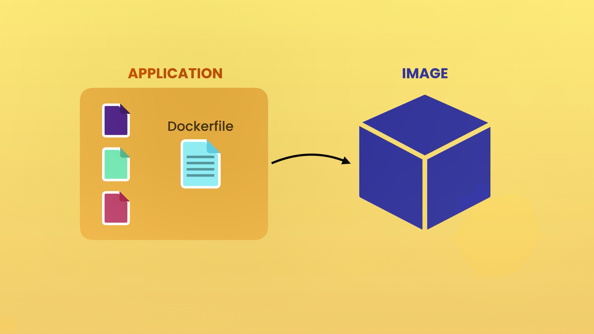

## Dockerfile

**Definition**: A Dockerfile is a plain-text file containing instructions for building a Docker image. It defines the steps required to assemble an image, including the operating system, application code, dependencies, environment variables, and configuration.

**Key Features**:

- **Layered Builds**: Each instruction in a Dockerfile creates a new image layer, enabling efficient reuse and storage of common layers.
- **Customizability**: Developers can tailor images to specific application requirements using a Dockerfile.

**Basic Structure**:
Here’s an example Dockerfile for a Node.js application:

```dockerfile
# Use a base image
FROM node:16

# Set the working directory
WORKDIR /app

# Copy application files
COPY package*.json ./
COPY . .

# Install dependencies
RUN npm install

# Expose the application port
EXPOSE 3000

# Define the command to run the application
CMD ["npm", "start"]

```

### Workflow:

Write a Dockerfile: Developers define the application's environment and dependencies in the Dockerfile.

Build the Image: Run the docker build command to create an image from the Dockerfile.

```
docker build -t my-app .
```
Run a Container: Use the built image to create and start a container.

```
docker run -d -p 3000:3000 my-app
```

### Relationship to Image:

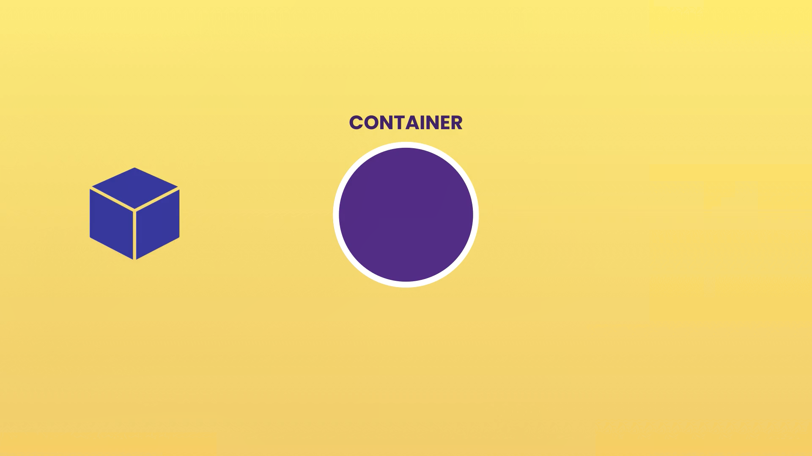

A Dockerfile is the blueprint for creating a Docker image.
The docker build command processes the Dockerfile to generate a reusable and portable image.

## Docker Images

**Definition**: A Docker image is a read-only template that contains instructions for creating a Docker container. It includes the application code, libraries, dependencies, and the necessary configuration to run the application.

**Key Characteristics**:

- **Layered Structure**: Images are built in layers, with each layer representing a set of file changes or instructions. This layering allows for efficient storage and reuse of common layers across multiple images.

- **Immutability**: Once created, images do not change. Any modifications result in the creation of a new image layer, ensuring consistency and reliability.
- 
It includes everything required to run an application, such as:

- **A stripped-down operating system** (e.g., Linux-based OS).
- **Runtime environment** (e.g., Node.js for JavaScript applications).
- **Application files**.
- **Third-party libraries** and dependencies.
- **Environment variables**.


## Docker Containers

**Definition**: A Docker container is a runtime instance of a Docker image. It encapsulates the application and its environment, running in an isolated process on the host system.

**Key Characteristics**:

- **Isolation**: Containers run in isolated environments, ensuring that applications do not interfere with each other or the host system.

- **Ephemeral Nature**: Containers can be started, stopped, and deleted without affecting the underlying image. Any changes made to a running container can be committed to create a new image layer.

**Analogy**: Think of a Docker image as a blueprint (class) and a container as a building (object) constructed from that blueprint. Multiple buildings can be constructed from the same blueprint, just as multiple containers can be instantiated from the same image.


## Relationship Between Images and Containers

- **Creation**: Containers are created from images. When you run an image, Docker creates a container based on that image.

- **Independence**: An image can exist without any containers, but a container cannot exist without an image. Containers depend on images as their source.

- **Lifecycle**: While images are static and immutable, containers are dynamic and can be modified during their lifecycle. Changes made to a container can be saved by committing those changes to a new image.


## Docker Hub

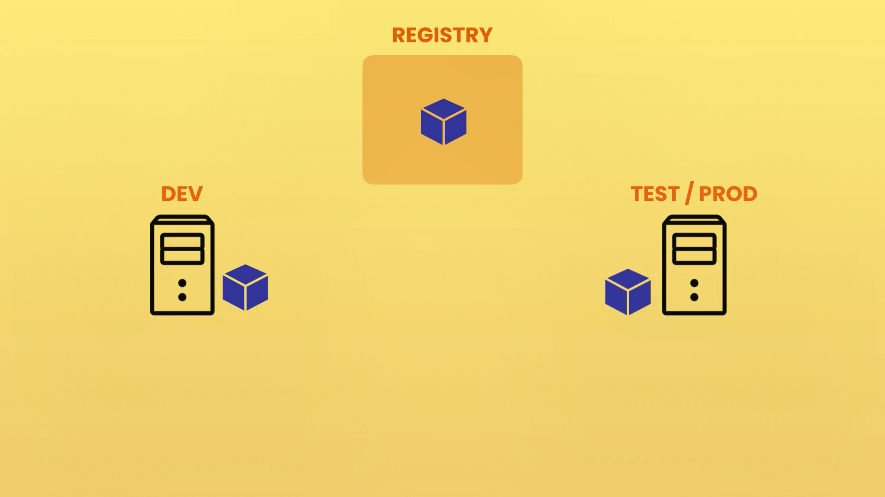

**Definition**: Docker Hub is a cloud-based repository service for storing, managing, and sharing Docker images. It serves as a central platform for developers to distribute and access containerized applications.

**Key Features**:

- **Image Repository**: Hosts both public and private repositories, allowing users to store and share Docker images.

- **Automated Builds**: Supports automated builds, allowing users to automatically build Docker images from source code.

- **Webhooks**: Notifies external services of events, such as when a new image is pushed to a repository.

- **Official Images**: Provides a library of curated images for popular applications and operating systems, maintained by Docker and the community.

## Docker Workflow: Development to Production

### Development (Dev):
Developers build and test Docker images on their local machines or development servers.
Using a Dockerfile, the application, dependencies, and environment are packaged into an image.
After testing the container locally, the image is deemed ready for sharing or deployment.

### Registry:

Once an image is finalized, it is pushed to a registry, such as Docker Hub, Amazon ECR, or a private repository. The registry acts as a centralized storage for Docker images.
The registry enables collaboration and easy sharing of images between development and production environments.

### Test/Production (Prod):

From the registry, the image is pulled into different environments:
- Test Environment: The image is deployed to a test server, where QA teams validate the application.
- Production Environment: Once the image passes testing, it is deployed to production servers where it runs live.

---

# Docker in Action

## 1. Setting Up the Directory and Files

### Step 1: Create a Directory
Use the `mkdir` command to create a new directory on the Desktop:

```bash
mkdir hello-docker
```

### Step 2: Navigate to the Directory
Change to the newly created directory using the `cd` command:
```bash
cd hello-docker
```

### Step 3: Open in Visual Studio Code
Open the directory in Visual Studio Code using:
```bash
code .
```

## 2. Creating the Application File

### Step 4: Create `app.js`
Inside the `hello-docker` directory, create a file named `app.js`. This file will be considered as our program. Add the following content:

```javascript
// app.js
console.log("Hello Docker!");
```
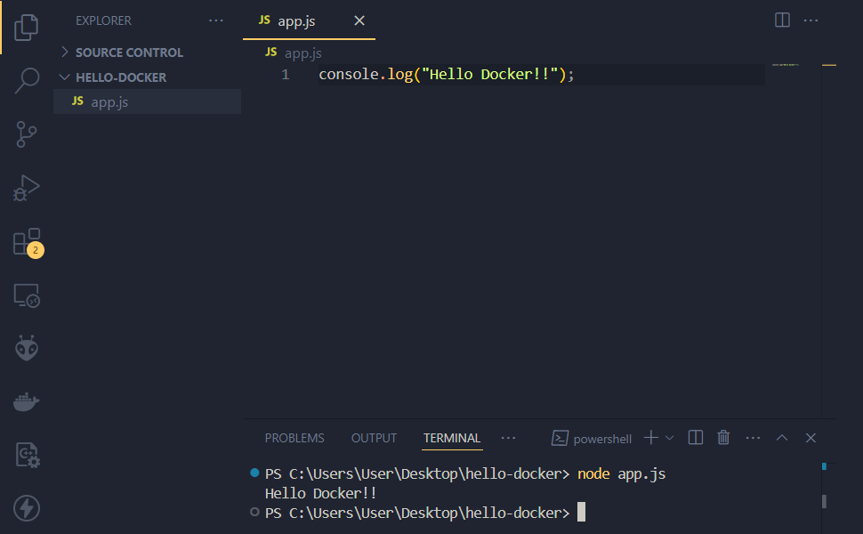

This program simply prints "Hello Docker!" to the console.

## 3. Creating the Dockerfile

### Step 5: Create a `Dockerfile`
Create a file named `Dockerfile` (no extension). Add the following content:

```dockerfile
# Dockerfile

# Use a lightweight Node.js image as the base image
FROM node:alpine

# Set the working directory inside the container
COPY . /app
WORKDIR /app

# Specify the command to run the application
CMD node app.js
```

#### **What is Alpine Linux?**

- Alpine Linux is a minimal and security-focused Linux distribution designed for containers.
- It is small in size (typically around 5 MB), making it ideal for creating lightweight Docker images.

#### **Why Use node:alpine?**
- Small Size: The node:alpine image is much smaller compared to the default Node.js images like node:latest, which are based on larger Linux distributions such as Debian or Ubuntu.
- Faster Builds: A smaller base image reduces the overall size of the Docker image, leading to faster downloads and deployments.
- Security: Alpine Linux is known for its minimal attack surface, making it a secure choice for containerized applications.
 
#### **Trade-offs of Using Alpine**
- Limited Tools: Since Alpine is minimal, some tools and libraries commonly found in larger distributions may be missing. If your application relies on such libraries, you may need to install them manually (e.g., using apk add).
- Potential Compatibility Issues: Some Node.js packages that require native dependencies may not compile easily on Alpine without additional setup.

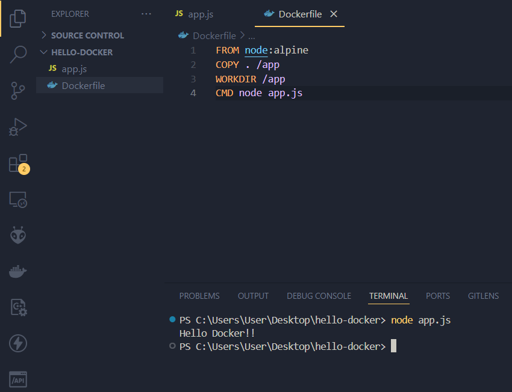

### Explanation of the Dockerfile
- `FROM node:alpine`: Specifies the base image, a lightweight version of Node.js, to build the container.
- `COPY . /app`: Copies the contents of the current directory on the host to `/app` in the container.
- `WORKDIR /app`: Sets the working directory inside the container to `/app`.
- `CMD node app.js`: Specifies the command to run the application (`node app.js`).

## 4. Building and Pushing the Docker Image

### Step 6: Build the Docker Image
Run the following command to build the Docker image:

```bash
docker build -t hello-docker .
```
- `-t hello-docker`: Tags the image with the name `hello-docker`.
- `.`: Specifies the current directory as the build context.

### Step 7: Verify the Image Creation

Run the following command to verify that the image has been created:

```
docker image ls
```

Example output:  

```
PS C:\Users\User\Desktop\hello-docker> docker image ls
REPOSITORY     TAG       IMAGE ID       CREATED          SIZE
hello-docker   latest    ad4719cb05b2   42 seconds ago   228MB
```

### Step 8: Login to Docker Hub
Log in to your Docker Hub account using:

```bash
docker login
```
Enter your Docker Hub username and password when prompted.

### Step 9: Tag the Image
Tag the image with your Docker Hub username and repository name:

```bash
docker tag hello-docker:latest <your_dockerhub_username>/hello-docker:latest
```
Replace `<your_dockerhub_username>` with your actual Docker Hub username.

#### **Tagging an image in Docker means :**
assigning it a name and version (or tag) to make it identifiable and easier to manage. When you build an image, Docker assigns it a default "latest" tag if you don't specify one. However, when you want to share the image (e.g., on Docker Hub), you need to provide a unique identifier that includes your Docker Hub username and the repository name.

For example:
```
docker tag hello-docker:latest <your_dockerhub_username>/hello-docker:latest
```
`hello-docker:latest ` :-The name of the image you built locally and its version tag (latest by default).
`<your_dockerhub_username>/hello-docker:latest ` :-The name of the image with your Docker Hub username as a prefix. This creates a "fully qualified" name for Docker Hub.

#### This tag ensures that:

- Docker knows which repository on Docker Hub the image belongs to.
- Users downloading the image can uniquely identify it.
 
Tagging is like labeling a file before sharing it. Without a proper tag, the image cannot be associated with your Docker Hub account and repository.

### Step 10: Push the Image
Push the image to Docker Hub using:

```bash
docker push <your_dockerhub_username>/hello-docker:latest
```
# Using Play with Docker to Pull and Run a Container from Docker Hub

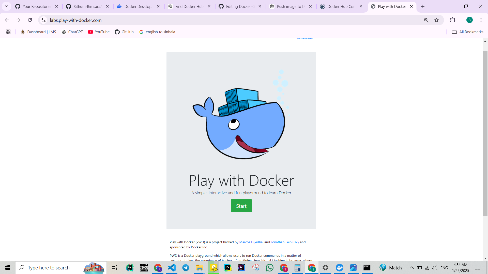

## Prerequisites
- A previously pushed container available on Docker Hub.
- Docker Hub account credentials.
- Access to **Play with Docker (PWD)**: [https://labs.play-with-docker.com](https://labs.play-with-docker.com).

## Steps to Pull and Run a Container in Play with Docker

### Step 1: Open Play with Docker
1. Visit [Play with Docker](https://labs.play-with-docker.com).
2. Log in with your Docker Hub account.
3. Once logged in, click **Start** to begin a session.

### Step 2: Create a New Instance
1. In the Play with Docker interface, click **+ ADD NEW INSTANCE**.
2. A virtual instance (VM) will be created, and you’ll see a terminal window for interacting with the instance.

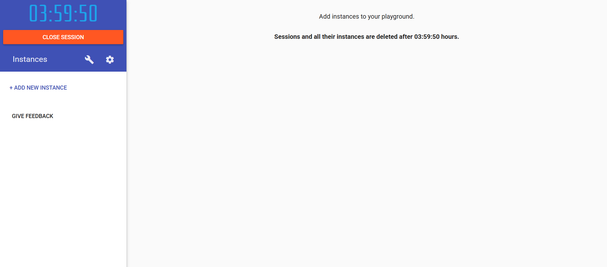

### Step 3: Pull the Docker Image
1. In the terminal, run the following command to pull your previously pushed Docker image from Docker Hub:
   ```bash
   docker pull <your_dockerhub_username>/<repository_name>:latest
   ```
Replace `<your_dockerhub_username>` and `<repository_name>` with your `Docker Hub username` and `repository name`. Example:

```
docker pull sithubmimsara2003/hello-docker:latest
```

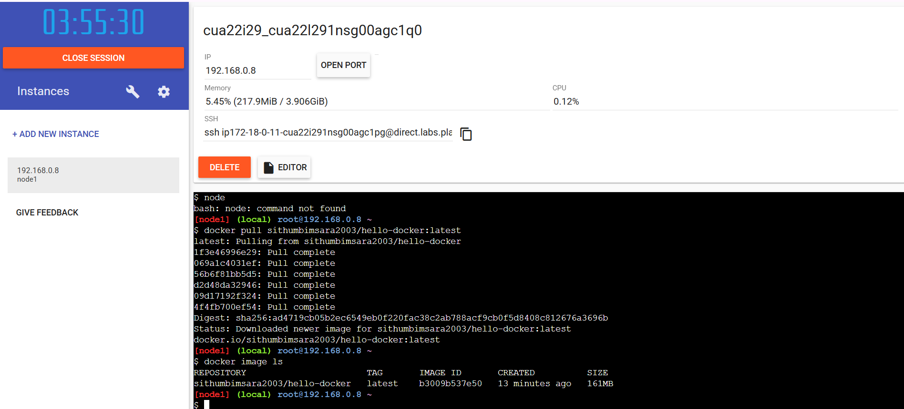


The terminal will show the progress of the pull process. For example:
```
Pull complete
Digest: sha256:<digest_hash>
Status: Downloaded newer image for <repository>:latest
```
### Step 4: Verify the Pulled Image
To confirm the image is downloaded, run:

```
docker image ls
```
The output will display the list of Docker images available in the instance. Example:

```
REPOSITORY                  TAG       IMAGE ID       CREATED          SIZE
sithubmimsara2003/hello-docker   latest    b30095b375c0   13 minutes ago   228MB
```

### Step 5: Run the Container
Use the following command to run the container:

```
docker run <repository>:<tag>
```
Example:

```
docker run sithubmimsara2003/hello-docker:latest
```
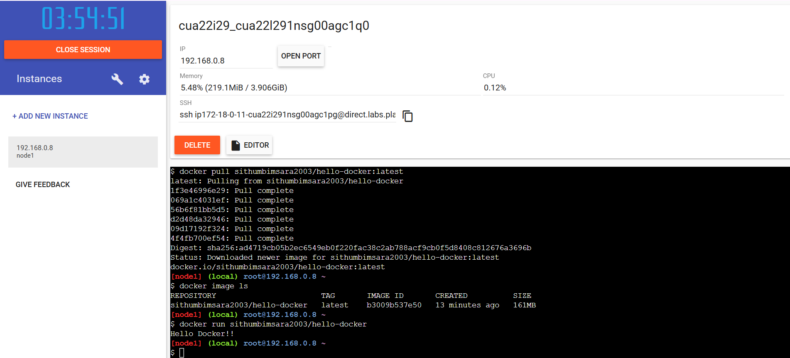

The container will execute the command specified in the Dockerfile (e.g., running node app.js).

If your image contains a Node.js script, it will display the output:

```
Hello Docker!
```
   
 ---
 # Linux Distributions

## Overview

Linux distributions, commonly referred to as `"distros,"` are versions of the Linux operating system bundled with various software packages and functionalities to cater to different user needs.

---

### Slide 3: Open Source


Open source is the foundation of Linux distributions, enabling collaboration and innovation by providing free access to software source code. This collaborative approach allows developers worldwide to contribute to and enhance the software, fostering rapid development and widespread adoption.

---

### Slide 4: Popular Linux Distros

- **Ubuntu**: Based on Debian, Ubuntu is user-friendly and widely used for desktops and servers.
- **Debian**: Known for its stability and extensive software repositories, Debian is a foundational distro for many others.
- **Alpine**: A security-oriented, lightweight distro popular for container-based deployments.
- **Fedora**: Sponsored by Red Hat, Fedora focuses on innovation and includes the latest features.
- **CentOS**: A free, community-supported platform functionally compatible with Red Hat Enterprise Linux.

---

## What is Linux?

Linux is a family of open-source Unix-like operating systems based on the Linux kernel, first released by Linus Torvalds on September 17, 1991. As an operating system, Linux manages hardware resources and provides essential services for application software. It's renowned for its stability, security, and flexibility, making it a preferred choice for servers, desktops, and embedded systems. :contentReference[oaicite:0]{index=0}

## Connection to Linux Distributions

A Linux distribution combines the Linux kernel with a selection of software packages, including system libraries, applications, and management tools, to create a complete operating system tailored for specific purposes. Distributions vary in focus, such as user-friendliness, security, or performance optimization, allowing users to choose a distro that best fits their requirements. :contentReference[oaicite:1]{index=1}

## Are All Distros Open Source?

While the Linux kernel itself is open source, not all Linux distributions are entirely open source. Many distros include proprietary software or drivers to enhance hardware compatibility and user experience. However, there are distributions committed to providing a completely free and open-source environment, adhering strictly to the principles of free software. Examples include Trisquel, Parabola, and PureOS, which exclude proprietary components and focus on software freedom. :contentReference[oaicite:2]{index=2}

---
# Running Linux with Docker


## Step 1: Pull the Ubuntu Docker Image

Run the following command to download the official Ubuntu image from Docker Hub:

```bash
docker pull ubuntu
```

This pulls the latest version of the Ubuntu image from the official Docker repository.

**or**
```
docker run ubuntu
```
If you use above command it will find ubuntu image in your local computer, if it is not founfd in locally then it will pull the the image to your local computer.
Following shows how its looks like if you run it.

```
Unable to find image 'ubuntu:latest' locally
latest: Pulling from library/ubuntu
de44b265507a: Download complete
Digest: sha256:80dd3c3b9c6cecb9f1667e9290b3bc61b78c2678c02cbdae5f0fea92cc6734ab
Status: Downloaded newer image for ubuntu:latest
```
Here's a breakdown of this output:

`Unable to find image 'ubuntu:latest' locally`      
- Docker checks if the specified image (ubuntu:latest) is available locally. If not, it proceeds to download it from Docker Hub.

`latest: Pulling from library/ubuntu`               
- Indicates that Docker is pulling the latest version of the Ubuntu image from the official library.

`de44b265507a: Download complete`                   
- Shows the progress of individual layers being downloaded. Each image consists of multiple layers, and Docker downloads them sequentially.

`Digest: sha256:...`                                
- Provides the SHA256 hash of the image, ensuring its integrity and authenticity.

`Status: Downloaded newer image for ubuntu:latest`  
- Confirms that the latest Ubuntu image has been successfully downloaded and is ready for use.

## Step 2: List Docker Containers
```
docker ps
```
- Lists only the running containers.
- If no containers are currently running, the command returns an empty list.
- Useful for checking the active containers.
```
CONTAINER ID   IMAGE       COMMAND       CREATED        STATUS       PORTS       NAMES
123abc456def   ubuntu      "/bin/bash"   5 minutes ago Up 5 minutes             amazing_alpaca
```

**To view all containers (running or stopped), use:**
```
docker ps -a
```
This lists all containers along with their statuses. For example:
```
CONTAINER ID   IMAGE    COMMAND                  STATUS                     NAMES
de3bd5f0e855   ubuntu   "/bin/bash"             Exited (0) 24 hours ago   angry_fermi
1d873957ae79   ubuntu   "/bin/bash"             Exited (0) 1 minute ago   gifted_haslett
Additional Observations
```
## Step 3: Run the Ubuntu Container

### Start a container interactively using the Ubuntu image:

```
docker run -it ubuntu
```

**Breakdown of docker `run -it ubuntu`:**

`-i (Interactive Mode):`

- Keeps the STDIN (standard input) open, even if you're not attached to the container.
- Allows the user to send input directly to the container (e.g., commands for the shell inside the container).

`-t (Pseudo-TTY):`

- Allocates a pseudo-TTY (terminal) for the container.
- This is needed to create a terminal-like interface, making it possible to run commands interactively.

**Combined Effect of -it:**

When these flags are used together:
  - You get an interactive terminal session inside the container.
  - This combination is typically used when you want to run commands or perform tasks inside the container's shell.
Example Usage:
```
docker run -it ubuntu
```
- This launches an Ubuntu container and opens an interactive terminal.
- By default, it runs the container's CMD or entry point (e.g., /bin/bash for many Linux-based images).
- You can interact with the container just like a Linux terminal.

**What Happens Without -it?**

If you run docker run ubuntu without -it, the container might execute its default command and exit (especially if no long-running process is specified). You won't be able to interact with it directly.

### When you run docker run -it ubuntu, and it starts an interactive shell, the prompt that appears:
```
root@21ddf621687e:/# 
```
**Shell is a programme that take  our commands and passes them to the os for execution.**

`root:`
- Indicates the user currently logged into the container.
- By default, when you run a container, you are logged in as the root user (the superuser in Linux with full administrative privileges).
- If the container has been configured with other users or you log in as a non-root user, this name would change.

`21ddf621687e:`
- Represents the container's hostname.
- Docker assigns a unique container ID (or a truncated version of it) as the hostname for each running container.
- In this case, 21ddf621687e is the unique identifier of your Ubuntu container.
- You can view the full container ID using: `docker ps -q`

`/:`
- Shows the current working directory in the container.
- / represents the root directory of the container's file system (the highest level of the file hierarchy in Linux).
- As you navigate through directories within the container (e.g., using cd /home), this part of the prompt will change to reflect the new working directory.

`#:`
- Indicates that you are working with root privileges in the shell.
- In Linux shell prompts:
  ``` 
  # signifies a superuser (root).
  $ signifies a regular user.
  ```
## Step 4: Verify Container Environment
Inside the running container, you can use basic Linux commands:

### Check the current user:
```
whoami
```
Output:
```
root
```
### Display the shell information:
```
echo $0
```
Output:
```t
/bin/bash
```
In the given command:
 - The $0 variable typically holds the name of the currently running shell or script. When run in an interactive shell, $0 outputs the shell being used. In this case, the output:
```
/bin/bash
```
can be broken down as follows:

`/bin:`
- Refers to the directory on the Linux filesystem where binaries (executable programs) are stored.
- /bin contains essential system programs and tools needed for the system to operate, such as shells (bash, sh, zsh) and basic commands (ls, echo, etc.).
- It is part of the system's PATH environment variable, so executables in this directory can be run from anywhere.

`bash:`
- Refers to the name of the shell you are using, which in this case is Bash.
- Bash stands for **"Bourne Again SHell"**, a widely used shell in Linux and Unix systems.
- It provides a command-line interface to interact with the operating system.

**Complete Meaning of /bin/bash:**
The output /bin/bash indicates:
- You are currently using the Bash shell, which is located in the /bin directory.
- The shell program /bin/bash is being executed to interpret your commands.
 
### View command history inside the container:
The history command can recall previously executed commands in the session.
```
history
```

```
root@21ddf621687e:/# history
    1  echo $0
    2  history
root@21ddf621687e:/#
```
#### Usage of `!<number>`
- It saves time by allowing you to quickly re-run previously executed commands without typing them again.

Example usage:-
```
root@21ddf621687e:/# echo $0
/bin/bash`
root@21ddf621687e:/# history
    1  echo $0
    2  history
root@21ddf621687e:/# !2
history
    1  echo $0
    2  history
root@21ddf621687e:/# !1
echo $0
/bin/bash
```

# Understanding Package Managers and `apt` Commands


## Overview of Package Managers

Package managers are tools that simplify the process of installing, upgrading, configuring, and removing software packages from a computer. 
They are an essential part of modern operating systems, providing a systematic way to manage dependencies and software.

### What Are They?

A package manager automates the following tasks:
- Downloading the correct version of software from a trusted repository.
- Resolving and installing dependencies required for the software to function.
- Keeping installed software up-to-date.
- Allowing for easy uninstallation of software.

### Usage of Package Managers

Common tasks performed using package managers:
- **Search for packages:** Find software you want to install.
- **Install packages:** Download and install software.
- **Update software:** Keep packages up-to-date with the latest features and bug fixes.
- **Remove packages:** Uninstall software you no longer need.

### Different Kinds of Package Managers

Here are some widely used package managers categorized by their ecosystems:

- **Operating Systems:**
  - `apt`: For Debian-based systems like Ubuntu.
  - `yum`/`dnf`: For Red Hat-based systems like Fedora.
  - `pacman`: For Arch Linux.

- **Programming Languages:**
  - `npm` and `yarn`: For JavaScript/Node.js.
  - `pip`: For Python.
  - `gem`: For Ruby.
  - `composer`: For PHP.

- **Others:**
  - `brew`: For macOS.
  - `choco`: For Windows.

Each package manager caters to specific environments and software ecosystems.


## Ubuntu Package Manager: `apt`

The `apt` (Advanced Package Tool) is a package management system used by Debian-based Linux distributions such as Ubuntu. It provides an easy-to-use command-line interface to manage software.

### Key Features of `apt`:
- Simplifies package management with minimal user interaction.
- Automatically resolves and installs software dependencies.
- Supports secure downloads from trusted repositories.


## Using `apt` Package Manager

`apt` is a powerful command-line tool for handling software packages on Debian-based systems. Here are some common commands:

1. **Update the Package List**  
   
   `apt update`
   
   This fetches the latest list of available software.

2. **Install a Package**  
   
   `apt install <package-name>`
   
   Example: To install `nano`, use `apt install nano`.

3. **Remove a Package**  
   
   `apt remove <package-name>`
   
   Example: To remove `nano`, use `apt remove nano`.

4. **List Installed Packages**  
   
   `apt list --installed`
   

5. **Get Information About a Package**  
   
   `apt show <package-name>`
   

The `apt-get` command is an older interface for managing packages, but it is still widely used.


## Installing and Using `nano`

### What is `nano`?

`nano` is a lightweight, easy-to-use text editor for Linux systems. It is often pre-installed in many distributions and is known for its simplicity.

### Steps to Install and Use `nano`

1. **Check if `nano` is Installed:**  
   Run the `nano` command to check if it is installed. If it is not, you will see an error: `Command not found`.
.png)


3. **Install `nano`:**
   Use the `apt` package manager to install `nano`:
   
   `apt install nano`

   .png)

   
   If you see a error like this you have to update apt packege list using `apt update`.

   Then you can run `apt install nano` without errors.

   
   .png)

5. **Open a File with `nano`:**  
   Create or edit a file using the `nano` command:

     .png)
   
   `nano <file-name>` or just `nano`
 

4. **Basic Commands in `nano`:**
   - **Save File:** Press `Ctrl + O`.
   - **Exit Editor:** Press `Ctrl + X`.
   - **Cut Line:** Press `Ctrl + K`.
   - **Paste Line:** Press `Ctrl + U`.

   .png)

5. **Remove `nano`:**  
   If you no longer need `nano`, remove it using:
  
   `apt remove nano`

   .png)

    `nano` is ideal for quick edits and is beginner-friendly compared to other text editors like `vim` or `emacs`.
# Linux File System

The Linux file system is a hierarchical structure that starts from the root directory (`/`) and expands into various directories that serve different purposes. Below is an overview of the key directories in the Linux file system:

.png)

## Root Directory (`/`)
The root directory is the starting point of the Linux file system. All other directories and files branch out from here.

### Key Directories under `/`:

- **`/bin`**: Essential user command binaries, such as `ls`, `cp`, and `mv`.
- **`/boot`**: Contains bootloader files, including the Linux kernel.
- **`/dev`**: Contains device files representing hardware devices.
- **`/etc`**: System-wide configuration files.
- **`/home`**: Home directories for users.
- **`/lib`**: Shared libraries and kernel modules.
- **`/root`**: Home directory for the root user.
- **`/var`**: Variable files like logs, caches, and spool files.
- **`/proc`**: Virtual filesystem providing information about processes.
- **`/tmp`**: Temporary files created by applications.
- **`/usr`**: User utilities and applications.

## "Everything is a File"
In Linux, the philosophy of "everything is a file" means that all system resources, including hardware devices and processes, are represented as files. This abstraction provides a consistent interface for interacting with different components.

### Examples:
- **Devices**: Files in `/dev` represent hardware devices like disks and printers.
- **Processes**: Files in `/proc` represent running processes.
- **Inter-Process Communication**: Mechanisms like pipes and sockets are treated as files.

This approach simplifies the system and allows developers to use standard file operations across various system resources.
"""

# Windows File System Details

.png)
# Windows File System

The Windows file system organizes files and directories under drive letters, such as `C:\`. Each drive serves as a separate root directory.

## Key Features of the Windows File System:
- **Drive Letters**: Separate storage devices are identified by drive letters like `C:`, `D:`, etc.
- **File Paths**: Use backslashes (`\`) to separate directories.
- **File Systems**: Common file systems include NTFS (New Technology File System) and FAT32 (File Allocation Table).

## Key Directories under `C:\`:

- **`C:\Program Files`**: Default location for installed applications.
- **`C:\Windows`**: System files and operating system components.
- **`C:\Users`**: Home directories for users.
- **`C:\Temp`**: Temporary files.
- **`C:\System32`**: Critical system files and executables.

### Comparison with Linux:
- Linux uses a unified directory structure starting from `/`, whereas Windows organizes files under separate drive letters.
- Linux treats everything as a file, while Windows differentiates between files and other resources like devices.

### Benefits of the "Everything is a File" Approach
- Simplicity: Developers can use standard file operations to interact with a wide range of system resources, reducing complexity.

- Flexibility: New devices and features can be integrated into the system without requiring new interfaces; they can be represented as files instead.

- Consistency: Users and applications interact with various system components in a uniform manner, enhancing usability and reducing the learning curve.
- # Linux Directory Commands and Observations

## Directory Navigation and Listings

1. **Command**: `pwd` - **(Print working directory)**
   - Displays the current working directory.
   - In this case, it shows `/`, which is the root directory.

2. **Command**: `ls`
   - Lists the files and directories in the current working directory.
   - Example output: `bin`, `dev`, `etc`, `lib32`, etc.

3. **Command**: `ls -l`
   - Provides a detailed listing of files and directories.
   - Example details:
     - `drwxr-xr-x`: Indicates directory permissions.
     - `root root`: Owner and group.
     - `bin -> usr/bin`: Symbolic link indicating `bin` is linked to `usr/bin`.

4. **Command**: `ls /bin` or `ls bin`
   - Lists files in the `/bin` directory, which contains essential binary executables.
   - Example executables: `whoami`, `xargs`, `yes`.

5. **Command**: `cd ..`
   - Moves up one directory level.
   - `cd../..`-Moves 2 levels up.


## Where You Are
1. **`root@c7d2e800b3cd:~#`**
   - Directory: `/root`
   - This is the home directory specific to the root user. It is used for storing personal files and configurations for the root user.
   - To navigate you can use `root@c7d2e800b3cd:/# cd /root` or either `root@c7d2e800b3cd:/# cd ~`
  

2. **`root@c7d2e800b3cd:/#`**
   - Directory: `/`
   - This is the root of the entire filesystem, containing directories like `/home`, `/usr`, `/var`, etc.

            Root Filesystem (/)
            ├── bin
            ├── boot
            ├── dev
            ├── etc
            ├── home
            │   └── user (e.g., `~` for non-root users)
            ├── root (`~` for the root user)
            ├── usr
            ├── var
            └── ... (other directories)


## Key Differences

| Path      | Represents                              | Typical Contents                              |
|-----------|----------------------------------------|-----------------------------------------------|
| `~`       | Home directory of the current user     | User-specific files and configurations        |
| `/`       | Root of the entire filesystem          | All system directories (e.g., `bin`, `usr`)   |

---
# Navigating the file system in Linux

## Observations

### 1. `mkdir test`
- **Command:** Creates a directory named `test`.
- **Output:** The directory `test` is created and visible when running `ls`.

### 2. `mv test docker`
- **Command:** Renames the `test` directory to `docker`.
- **Output:** The directory `test` is no longer listed, and a new directory named `docker` is visible.

### 3. `touch hello.txt`
- **Command:** Creates an empty file named `hello.txt` inside the `docker` directory.
- **Output:** The file `hello.txt` is visible when running `ls` inside `docker`.

### 4. `touch file1.txt file2.txt file3.txt`
- **Command:** Creates three empty files: `file1.txt`, `file2.txt`, and `file3.txt` inside the `docker` directory.
- **Output:** All files are visible when running `ls` inside `docker`.

### 5. `rm file1.txt`
- **Command:** Deletes the `file1.txt` in the `docker` directory. 
- **Output:** Only `file1.txt` will not be able to see when running `ls`.   

### 5. `rm file1.txt file2.txt file3.txt`
- **Command:** Deletes the `file1.txt`,`file2.txt`,`file3.txt` in the `docker` directory. 
- **Output:** Only `file1.txt` will not be able to see when running `ls`.    

### 6. `rm file*`
- **Command:** Deletes all files in the `docker` directory that match the pattern `file*` (e.g., `file1.txt`, `file2.txt`, and `file3.txt`).
- **Output:** Only `hello.txt` remains when running `ls`.

### 7. `rm -r docker`
- **Command:** Deletes the `docker` directory and its contents recursively.
- **Output:** The `docker` directory is no longer listed when running `ls`.

### 8. `mv hello.txt /etc`
- **Command:** `mv hello.txt /etc` means you are moving the file `hello.tx`t from its current location to the `/etc` directory. `
---
# Manupulating Files & Directories in Linux

### 1. **`cat` Command**
The `cat` command is used to:
- View the contents of a file.
- Concatenate files.

#### Example:

`cat file1.txt`

#### Advantages:
- Simple and quick for viewing small files.

#### Disadvantages:
- Not suitable for large files as it displays everything at once.

### 2. `more` Command
The more command is used to view large files one screen at a time.

#### Example:

`more file1.txt`

#### Advantages over cat:
- Displays content one screen at a time, making it easier to handle large files.
- 
#### Key Bindings:
-`Space`: Scroll to the next page.
-`Enter`: Scroll line by line.
-`q`: Quit.

### 3. `less` Command
The less command is similar to more, but with additional functionality and flexibility.

##### Installation:
If less is not installed, you can install it using:
`apt install less`

#### Example:

`less file1.txt`

#### Advantages over more and cat:

- Allows both forward and backward navigation in the file.
- Doesn't load the entire file into memory, making it faster for large files.

#### Key Bindings:

`Space`: Scroll to the next page.

`Enter`: Scroll line by line.

`Up/Down Arrows`: Scroll line by line in respective directions.

`b`: Scroll one page backward.

`q`: Quit.


# Echo Command in Ubuntu

The `echo` command is used in Ubuntu (and other Unix-like systems) to display a line of text or output the value of a variable.

## Basic Syntax

`echo [option] [string...]`


### 1. Displaying Text
You can simply output text using `echo`:

`echo "Hello, Ubuntu!"`

Output: `Hello, Ubuntu!`

### 2. Displaying Variables
You can display the value of variables:

`name="Ubuntu"`
`echo "Hello, $name!"`

Output: `Hello, Ubuntu!`

### 3. Prevent Newline with `-n`
By default, `echo` appends a newline character after the message. Use `-n` to prevent this:

`echo -n "Hello"`

Output: `Hello` (no newline)

### 4. Enabling Escape Sequences with `-e`
Use the `-e` option to interpret special escape sequences like newline, tab , etc.

`echo -e "Hello`
`World"`

Output:
```
Hello
World
```

### 5. Redirecting Output to a File
You can use `echo` to write text to a file:

`echo "This is a log entry" > logfile.txt`

This creates (or overwrites) `logfile.txt` with the given text.

### 6. Command Substitution
You can use `echo` in combination with command substitution:

`echo "Current directory: $(pwd)"`

This will output the current working directory.

`root@eb627f8f4c93:/# echo "$(ls)">> text3.txt`

`root@eb627f8f4c93:/# cat text3.txt`
```
(ls)
bin
boot
dev
etc
home
lib
root
text3.txt
var
```

# Redirection Operators

`>`: Redirects output to a file (overwrites the file if it exists).
`>>`: Redirects output to a file (appends to the file if it exists).


### 1.Creating a new file with specific content:

`echo "This is a test file" > test.txt`

### 2.Combining contents of files:

`cat file1.txt file2.txt > combined.txt`

### 3.Listing directory contents into a file for documentation:
 
`root@eb627f8f4c93:/# cd ~`

`root@eb627f8f4c93:~# pwd >> text3.txt`

`root@eb627f8f4c93:~# cat text3.txt`

Output: 
`/root`


## `>>` Operator: Append Output to a File

**The >> operator is used to redirect output to a file, appending the output to the end of the file instead of overwriting it. If the file does not exist, it will be created.**

**Usage Syntax**

`command >> filename`

### 1. Append a Message to a File
If you already have a file and want to add new content to it:

`echo "This is the first line." > example.txt `  # Create a file with initial content

`echo "This is an appended line." >> example.txt`

Now, the contents of example.txt will be:
```
This is the first line.
This is an appended line.
```
### 2. Append the Output of a Command
To append the output of a command to an existing file:

`ls -l >> directory_list.txt`

This appends the list of files in the current directory to the file directory_list.txt.

# Linux Text Search Commands

Linux provides several commands for searching text within files and directories. These commands are highly efficient and customizable. Below are some key commands along with their usage and examples.

---

## **1. `grep` Command**

The `grep` command is used to search for specific patterns or text within files. 

### **Basic Syntax**

`grep [options] 'pattern' file`


### **Common Options**
- `-i`: Ignore case (case-insensitive search).
- `-r`: Recursively search files in directories.
- `-l`: Display the file names containing the matching lines.
- `-n`: Display line numbers of matching lines.

### **Examples**
#### Search for a Word in a File

`grep hello file1.txt`

This searches for the word "hello" in `file1.txt`.

#### Case-Insensitive Search

`grep -i hello file1.txt`

This searches for "hello" in any case (e.g., Hello, HELLO).

#### Search Multiple Files

`grep -i hello file1.txt file2.txt`

Searches for "hello" in both `file1.txt` and `file2.txt`.

#### Search in All Files with a Pattern

`grep -i hello file*`

This searches for "hello" in all files starting with `file`.

#### Recursive Search in a Directory

`grep -r hello .`

Searches for "hello" recursively in the current directory (`.`).

#### Recursive and Case-Insensitive Search

`grep -ir hello .`

This performs a case-insensitive recursive search for "hello" in the current directory.

## **Usage Tips**

### **Redirect Search Results to a File**
You can save the search results to a file using redirection:

`grep -ir hello . > results.txt`

This stores all matches for "hello" in `results.txt`.

### **Combine with Other Commands**
Use `grep` with `ls`, `cat`, or `find` to enhance your workflow. For example:

`ls | grep file`

Filters the output of `ls` to show only filenames containing "file".

---

### **Advanced Usage**
#### Display File Names Only
```bash
grep -l hello file*
```
Lists only the filenames containing "hello".

#### Display Line Numbers
```bash
grep -n hello file1.txt
```
Shows the line numbers where "hello" appears.

#### Search for Whole Words
```bash
grep -w hello file1.txt
```
Matches only the word "hello" and not substrings like "hello123".

---

These commands help you efficiently locate and analyze text within files and directories on Linux systems. Let me know if you'd like further details or examples!

# Finding Files and Directories in Linux

The `find` command in Linux is a powerful utility used to search for files and directories based on various criteria such as name, type, size, or modification time. Here is an explanation of the commands shown in the provided screenshots:

---

## Basic Commands

### 1. **Listing Files in the Current Directory including hidden ones**
```bash
ls -a
```
- Displays all files and directories, including hidden ones (those starting with a dot `.`).
- Example output:
  ```
  .bashrc
  .profile
  combined.txt
  file1.txt
  file2.txt
  files.txt
  hello.txt
  ```

---

## Using the `find` Command

### 2. **Find Directories in the Current Directory**
```bash
find -type d
```
- Searches for directories (`-type d`) in the current directory and subdirectories.
- Example output:
  ```
  ./
  ./.local
  ./.local/share
  ```

### 3. **Find Files in the Current Directory**
```bash
find -type f
```
- Searches for files (`-type f`) in the current directory and subdirectories.
- Example output:
  ```
  ./file1.txt
  ./file2.txt
  ./files.txt
  ```

---

## Advanced Commands

### 4. **Find a File by Name**
```bash
find -type f -name "file.txt"
```
- Searches for a file with names matching `file1.txt`.
- Example output:
  ```
  ./file.txt
  ```

  
### 5. **Find Files by Name**
```bash
find -type f -name "file*.txt"
```
- Searches for files with names matching the pattern `file*.txt`. The `*` is a wildcard that matches any sequence of characters.
- Example output:
  ```
  ./file1.txt
  ./file2.txt
  ./files.txt
  ```

### 6. **Case-Insensitive Search for Files by Name**
```bash
find -type f -iname "file*.txt"
```
- Searches for files with names matching the pattern `file*.txt`, ignoring case sensitivity (`-iname`).
- Example output:
  ```
  ./file1.txt
  ./file2.txt
  ./files.txt
  ```

### 7. **Find Python Files in Root Directory and Save to a File**
```bash
find / -type f -name "*.py" > python-files.txt
```
- Searches the entire file system (`/`) for Python files (`*.py`) and writes the results to `python-files.txt`.
- To view the contents of the file:
  ```bash
  cat python-files.txt
  ```
- Example output:
  ```
  /usr/share/gcc-10/python/libstdcxx/v6/printers.py
  /usr/share/gcc-10/python/libstdcxx/v6/xmethods.py
  /usr/share/gcc-10/python/libstdcxx/__init__.py
  ...
  ```

---

## Notes
- **`-type d`**: Search for directories.
- **`-type f`**: Search for files.
- **`-name`**: Match file or directory names exactly.
- **`-iname`**: Match names case-insensitively.
- **`>`**: Redirect output to a file.
- **`cat`**: Display the contents of a file.

By mastering these commands, you can efficiently locate and manage files and directories in Linux systems.

# Linux Command Chaining

Linux command chaining allows users to execute multiple commands in a single line. Below are examples of different types of command chaining methods and their uses:

---

## 1. **Semicolon (`;`)**

- **Usage**: Executes all commands sequentially, regardless of whether the previous command succeeded or failed.

```bash
mkdir test ; cd test ; echo "done"
```
- **Explanation**:
  - `mkdir test`: Creates a directory named `test`.
  - `cd test`: Changes to the `test` directory.
  - `echo "done"`: Prints "done" to the console.

---

## 2. **Logical AND (`&&`)**

- **Usage**: Executes the next command only if the previous command succeeds.

```bash
mkdir test && cd test && echo "done"
```
- **Explanation**:
  - If `mkdir test` is successful, then `cd test` is executed.
  - If `cd test` is successful, then `echo "done"` is executed.

---

## 3. **Logical OR (`||`)**

- **Usage**: Executes the next command only if the previous command fails.

```bash
mkdir test || echo "directory exists"
```
- **Explanation**:
  - If `mkdir test` fails (e.g., the directory already exists), then `echo "directory exists"` is executed.

---

## 4. **Combination of AND and OR**

- **Usage**: Combines both `&&` and `||` to handle success and failure scenarios.

```bash
mkdir test && echo "Directory created" || echo "Directory creation failed"
```
- **Explanation**:
  - If `mkdir test` is successful, "Directory created" is printed.
  - If it fails, "Directory creation failed" is printed.

---

## 5. **Backslash (`\`)**

- **Usage**: Used to split long commands across multiple lines for better readability.

```bash
mkdir hello ; \
cd hello ; \
echo "done"
```
- **Explanation**:
  - `mkdir hello`: Creates a directory named `hello`.
  - `cd hello`: Changes to the `hello` directory.
  - `echo "done"`: Prints "done" to the console.

---

## 6. **Using `ls` with Pipes**

- **Usage**: List contents of directories and filter results using `head` or `less`.

```bash
ls /bin | less
ls /bin | head
```
- **Explanation**:
  - `ls /bin | less`: Displays the contents of `/bin` page by page.
  - `ls /bin | head`: Displays the first 10 entries of `/bin`.

---

These chaining techniques can be combined to create powerful, compact, and efficient command sequences for complex tasks.


```bash
mkdir Docker && cd Docker || echo done
```

Explanation:
- mkdir Docker:This command creates a new directory named Docker in the current working directory (~/Docker1).
- && cd Docker:If the mkdir Docker command succeeds (i.e., the directory is successfully created), the && operator ensures that the next command (cd Docker) is executed.The cd Docker command changes the current directory to the newly created Docker directory.
- || echo done:If the mkdir Docker command fails (e.g., the Docker directory already exists), the && operator skips the cd Docker command, and the || operator executes the echo done command instead.
echo done simply prints the word "done" to the terminal.

Result:

`root@0eae6b3abb4c:~/Docker1/Docker#`

- The current working directory will be 

`~/Docker1/Docker.`

- If the Docker directory already exists, it will print:

`done`

The working directory will remain unchanged.


