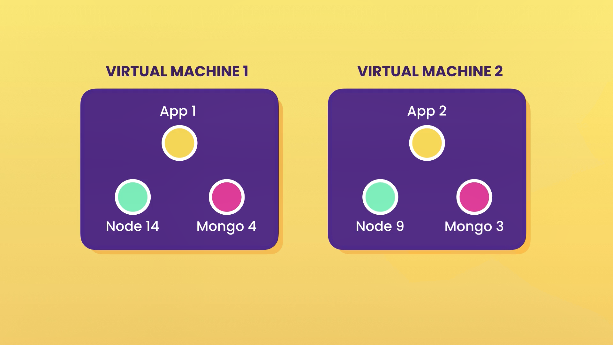

# **Docker-Guide**

---
## Why we want Docker?

Docker is important because it solves common issues related to software development and deployment by providing a consistent and isolated environment for applications. 

- one or more files missing.
- software version mismatch.
- different configuration settings.

## Why Docker Is Important:
#### **Consistency**
The same Docker container works identically on any system with Docker installed, ensuring that software runs reliably regardless of the environment.

#### **Isolation**
Each container runs in its isolated environment, preventing conflicts between applications or services running on the same host.

#### **Portability**
Applications in Docker containers can easily be moved between development, testing, and production, reducing deployment headaches.

#### **Efficient Resource Use**
Docker containers are lightweight and share the host OS kernel, making them more efficient than traditional virtual machines.

#### **Ease of Collaboration**
Teams can share the same containerized environment, ensuring that everyone works with the same setup. This eliminates environment-related discrepancies.

#### **Simplified Project Deletion**

**Importance**: When a project needs to be deleted, Docker makes it straightforward by encapsulating the entire application, dependencies, and configurations in containers and images.

**How**: By removing the container and its associated image (docker rm and docker rmi), all files, dependencies, and settings tied to the project are erased from the system without leaving behind residual files or affecting other projects.

**Benefit**: This prevents clutter and ensures that the system remains clean without manual hunting for files, dependencies, or configurations to delete.

---

# Containers vs Virtual Machines

## **What is a Container?**
- An isolated environment for running an application.

## **What is a Virtual Machine?**
- An abstraction of a machine (physical hardware).

### **What are Virtual Machines Used For?**

Virtual Machines (VMs) provide an isolated environment that emulates physical hardware, enabling multiple operating systems to run on a single host machine. They are commonly used for:  
1. **Application Testing**: Testing applications on different operating systems or configurations.  
2. **Legacy Software**: Running software that requires outdated or specific environments.  
3. **Server Consolidation**: Running multiple servers on one physical machine to save resources.  
4. **Development and Training**: Providing isolated, disposable environments for developers or training purposes.

### Example:

- **Virtual Machine 1**: App 1, Node 14, Mongo 4
-  
  Virtual Machine 1 can be used to host an application that requires Node.js version 14 and MongoDB version 4. This setup ensures that the application has a dedicated environment without conflicts from other applications or dependencies.

- **Virtual Machine 2**: App 2, Node 9, Mongo 3  
  
  Virtual Machine 2 provides an isolated space for running another application with Node.js version 9 and MongoDB version 3. It is particularly useful for legacy applications or projects that require older versions of software to function correctly.

## **Hypervisors**
- Hypervisors act as the foundation for running virtual machines.

### Common Hypervisors:
- VirtualBox
- VMware
- Hyper-V (Windows only)

## **Problems with Virtual Machines**
1. Each VM needs a full-blown OS.
2. Slow to start.
3. Resource-intensive.

## **Benefits of Containers**
1. Allow running multiple apps in isolation.
2. Lightweight.
3. Use the OS of the host.
4. Start quickly.
5. Need less hardware resources.
---
# Docker Architecture and Usage

## Overview

Docker is a platform that enables developers to build, deploy, and manage applications in lightweight containers. It leverages containerization technology to create isolated environments for running applications, ensuring consistency and efficiency across various platforms.

---

## Docker Client-Server Architecture

### Client and Server

Docker follows a **Client-Server Architecture**:

- **Client**: Sends requests to the server to perform tasks such as building, running, and managing containers. These requests are sent via REST APIs.
- **Server (Docker Engine)**: Processes client requests and handles container operations.

### REST API

**REST API (Representational State Transfer API)** is a communication method used for client-server interaction. It uses HTTP methods like `GET`, `POST`, and `DELETE` for resource management.

In Docker:

1. **Client** sends a REST API request to the server (Docker Engine).
2. **Docker Engine** interprets the request and executes the corresponding action (e.g., creating or starting a container).

Example:

- The client sends a `docker run` command → Translates into a REST API request → Docker Engine executes the request.
- 
### Kernel

The **kernel** is the core component of an operating system, managing system resources and communication between hardware and software. In the context of Docker:

- **Linux Kernel**: Docker relies on features like namespaces and cgroups in the Linux kernel to provide isolation and resource management for containers.
- **Windows Kernel**: For Windows containers, Docker utilizes Windows Server Containers or Hyper-V isolation to run containers natively on the Windows kernel.

### **It's important to note that Docker containers share the host system's kernel; they do not have their own separate kernel. This shared kernel approach allows containers to be lightweight and efficient, as they avoid the overhead associated with running separate operating system instances, unlike traditional virtual machines**

### Containers and Processes

- Containers are lightweight, isolated environments that run applications.
- They share the **host OS kernel**, making them faster and more resource-efficient than virtual machines (VMs).
- A container can be thought of as a **process** running on the host operating system.

## Docker on Various Platforms

### Windows

On Windows, Docker can run both Windows and Linux containers, but not simultaneously. Users can switch between the two modes:

1. **Windows Containers**: Run natively on the Windows kernel.
2. **Linux Containers**: Run within a lightweight virtual machine provided by the Windows Subsystem for Linux 2 (WSL 2).

**Windows Subsystem for Linux (WSL)** is a compatibility layer for running Linux binary executables natively on Windows. **WSL 2** introduces a full Linux kernel, improving performance and system call compatibility. Docker Desktop leverages WSL 2 to run Linux containers on Windows efficiently. :contentReference[oaicite:0]{index=0}

### Linux

On Linux systems, Docker runs natively:

- **Native Execution**: Docker utilizes the host's Linux kernel features, such as namespaces and cgroups, to create isolated containers without the need for a separate virtual machine. This results in efficient and performant container operations. :contentReference[oaicite:4]{index=4}

### macOS

On macOS, Docker utilizes a Linux virtual machine to run containers:

- **Hypervisor Framework**: Docker Desktop for Mac uses Apple's Hypervisor framework to create a lightweight virtual machine that runs a Linux kernel. This VM hosts the Docker Engine and manages containers. :contentReference[oaicite:2]{index=2}

- **File System and Network Integration**: Docker Desktop integrates with macOS to provide seamless file system sharing and network connectivity between the host and the containers. :contentReference[oaicite:3]{index=3}

---

